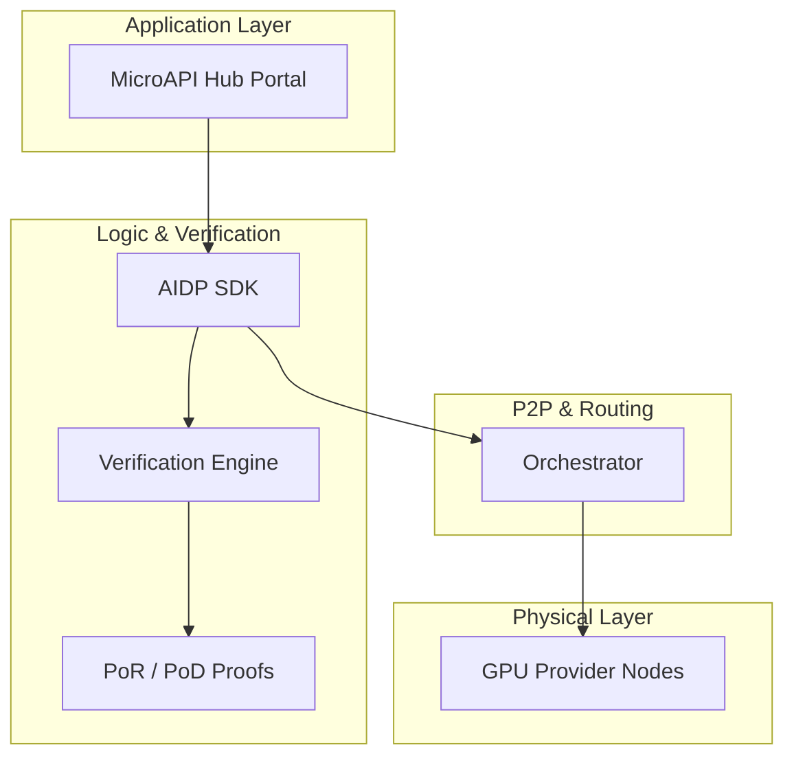

# 🌐 MicroAPI Hub
### Enterprise-Grade Decentralized AI Infrastructure on AIDP

**Seamlessly route, verify, and scale AI inference via a global network of decentralized GPUs.**

[](LICENSE)
[](https://aidp.store)
[](https://solana.com)
[](https://github.com/0xsupremedev/aidp-hub)

---

## 🚀 The Vision

MicroAPI Hub is the production-ready gateway to the **AIDP Ecosystem**. It transforms decentralized compute from a speculative asset into a reliable utility for developers. By abstracting the complexity of P2P routing and cryptographic verification, we provide a "calm infrastructure" experience that competes with centralized cloud providers on performance, cost, and reliability.

---

## 🛠 Tech Stack

<div align="center">
  
</div>

- **Frontend**: React 18 (Hooks/Context API), TypeScript, Vite.
- **Styling**: Vanilla CSS (Custom Variable-based Design System) + Framer Motion.
- **Icons**: Lucide React.
- **Charts**: Custom SVG visualizations.
- **Backend**: Node.js, Express, TS (Production API Gateway).
- **Network**: AIDP Decentralized Physical Infrastructure (DePIN).
- **Blockchain**: Solana ($AIDP Settlement).

---

## ✨ Core Features

- **Authoritative Control Panel**: A high-trust side-sheet for managing Identity, Security, and Billing.
- **Cryptographic Proof Engine**: Real-time PoR/PoD verification using SHA-256 traces.
- **Usage Forecasting**: Predictive spend analysis for developer budget management.
- **Live Infrastructure Hub**: Monitor global network vitals, latency clusters, and job timelines.
- **Governance & Staking**: Modular protocol views for community-led network growth.

---

## 🏛 5-Layer DePIN Architecture

The codebase follows the systematic **AIDP 5-Layer Design** for modular infrastructure:



- **`aidp-marketplace`**: The primary interaction layer for developers.
- **`aidp-sdk`**: Cryptographic libraries for PoR/PoD proof generation.
- **`aidp-orchestrator`**: Intelligent routing for decentralized inference.
- **`aidp-verification`**: The settlement engine for trustless work.
- **`aidp-node`**: Software for the physical GPU providers.

---

## 🏆 Ecosystem Campaign: "Build or Bring"

MicroAPI Hub is a flagship participation portal for the **AIDP Ecosystem Campaign**.

- **BUILD Track**: Integrate AIDP compute into your own AI applications.
- **BRING Track**: Refer new GPU nodes to the network.
- **Rewards**: **350 USDC** prize pools per track (2-week marathon).
- **$AIDP Token**: `PLNk8NUTBeptajEX9GzZrxsYPJ1psnw62dPnWkGcyai` (SOL)

---

## 🏁 Quick Start

### 📦 Installation
```bash
git clone https://github.com/0xsupremedev/aidp-hub.git
cd aidp-hub
npm install
```

### ⚡ Development
Run the gateway and frontend in parallel:
```bash
# Terminal A: Production API
npm run server

# Terminal B: Developer Portal
npm run dev
```

---

## 🔒 Security & Privacy

- **Cryptographic Identity**: Manage signing keys for decentralized requests.
- **Passkeys & 2FA**: Standard-compliant security for developer accounts.
- **Zero-Trust Monitoring**: Every inference response is non-custodial and verifiable.

---

Built with ❤️ by **[0xsupremedev](https://github.com/0xsupremedev)** for the AIDP Hackathon.